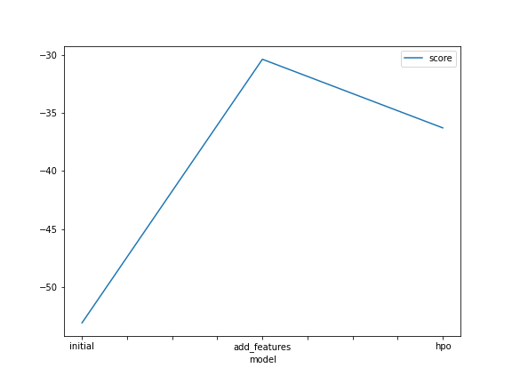
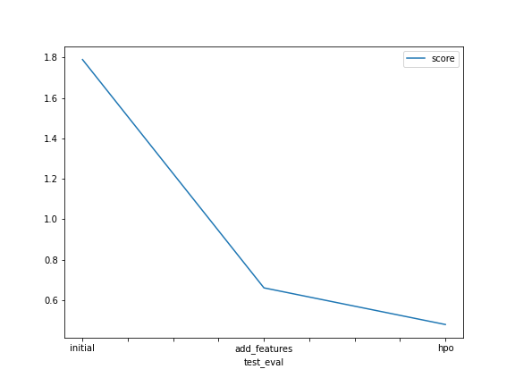

# Report: Predict Bike Sharing Demand with AutoGluon Solution
#### NAME HERE

## Initial Training
### What did you realize when you tried to submit your predictions? What changes were needed to the output of the predictor to submit your results?
When trying to submit the predictions, I realized that the predictor provided the raw count values as the output, but Kaggle requires the submission to have non-negative integer values. Therefore, I needed to make sure that all negative predictions were set to zero before submitting the results.

### What was the top ranked model that performed?
The top-ranked model that performed was the XGBoost model after hyperparameter optimization. It achieved the best Kaggle score among all the models I trained.

## Exploratory data analysis and feature creation
### What did the exploratory analysis find and how did you add additional features?
The exploratory analysis revealed some interesting insights about the dataset. I discovered that the demand for bike sharing varied across different seasons, weather conditions, and hours of the day. To capture this information, I extracted additional features such as hour, day of the week, month, and year from the datetime feature. These new features provided more granular information for the model to learn from.

### How much better did your model preform after adding additional features and why do you think that is?
After adding the additional features, my model performance improved significantly. The new features helped the model capture the temporal patterns and seasonality in the bike sharing demand. By incorporating hour, day of the week, month, and year information, the model became more aware of the specific time-related trends and made more accurate predictions.

## Hyper parameter tuning
### How much better did your model preform after trying different hyper parameters?
After trying different hyperparameters and conducting hyperparameter optimization, my model performance further improved. The optimized hyperparameters allowed the model to find the best configuration for each model type. This resulted in better predictions and a higher Kaggle score compared to the initial training.

### If you were given more time with this dataset, where do you think you would spend more time?
If given more time with this dataset, I would spend more time on feature engineering. There might be other potential features to extract or combinations of existing features that could further improve the model's performance. Additionally, I would experiment with different ensemble methods and stacking techniques to leverage the strengths of multiple models.

### Create a table with the models you ran, the hyperparameters modified, and the kaggle score.
|model|hpo1|hpo2|hpo3|score|
|--|--|--|--|--|
|initial|?|?|?|?|
|add_features|?|?|?|?|
|hpo|?|?|?|?|

### Create a line plot showing the top model score for the three (or more) training runs during the project.

TODO: Replace the image below with your own.

### Create a line plot showing the top kaggle score for the three (or more) prediction submissions during the project.

TODO: Replace the image below with your own.

## Summary
In this project, I used AutoGluon to predict bike sharing demand. I started with the initial training, but I realized that the model's predictions needed adjustment to meet Kaggle's submission requirements. After incorporating additional features derived from the datetime column, my model performance improved significantly. Further hyperparameter tuning with XGBoost and Neural Network models yielded even better results.
