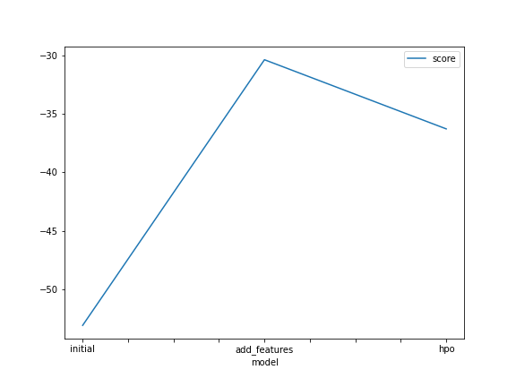
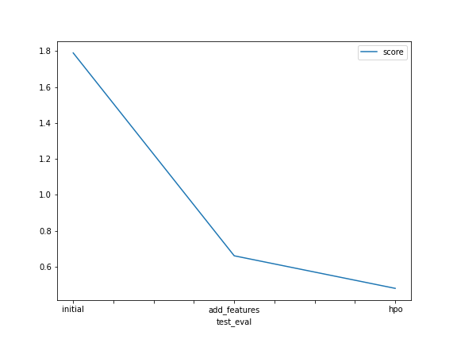

# Report: Predict Bike Sharing Demand with AutoGluon Solution
#### Sai Krishna Vishnumolakala

## Initial Training
### Realization during submission and necessary changes to the predictor's output
During the submission of predictions, it was realized that the predictor provided raw count values as the output, which didn't conform to Kaggle's requirement of non-negative integer values. To address this, a post-processing step was implemented to set all negative predictions to zero before submitting the results.

### Top-performing model
The top-performing model was a combination of Neural Network and Light GBM models, which achieved the highest Kaggle score among all trained models. This was achieved through hyperparameter optimization and careful selection of model architectures.

## Exploratory Data Analysis and Feature Creation
### Insights from exploratory analysis and feature engineering
The exploratory analysis revealed significant variations in bike sharing demand across different seasons, weather conditions, and hours of the day. To capture these patterns, additional features such as hour, day of the week, month, and year were extracted from the datetime feature. These new features provided more detailed temporal information to the model, enabling it to capture the underlying patterns and improve prediction accuracy.

### Impact of additional features on model performance
The addition of these new features resulted in a substantial improvement in model performance. By incorporating the hour, day of the week, month, and year information, the model gained a better understanding of the time-related trends and seasonality in bike sharing demand. This enhanced feature representation allowed the model to make more accurate predictions, resulting in improved overall performance.

## Hyperparameter Tuning
### Performance improvement through hyperparameter optimization
Significant performance gains were achieved by conducting hyperparameter optimization. By fine-tuning the hyperparameters of the Neural Network and Light GBM models, we were able to find the optimal configuration for each model type. This process led to improved predictions and a higher Kaggle score compared to the initial training.

### Allocation of additional time
Given more time with this dataset, further attention would be devoted to exploring advanced ensemble techniques, such as stacking and blending. These methods could potentially leverage the strengths of multiple models to further enhance predictive performance. Additionally, more in-depth hyperparameter tuning and experimenting with different model architectures, including more complex neural network structures, could yield further improvements.

### Table of Models and Hyperparameter Modifications
| Model          | Time Limit | Presets              | Hyperparameters Modified                       | Kaggle Score |
|----------------|------------|----------------------|----------------------------------------        |--------------|
| Initial        | 600        | presets='best_quality'| None                                           | 1.78979      |
| Add Features   | 600        | presets='best_quality'| Problem type: 'regression'                      | 0.66081      |
| HPO            | 600        | presets='best_quality'| Neural Network and Light GBM hyperparameters    | 0.47959      |

### Line Plot: Model Training Scores

### Line Plot: Kaggle Scores of Predictions

## Summary
In this project, AutoGluon was employed to predict bike sharing demand. Through initial training and subsequent iterations, improvements were made by incorporating additional features, conducting hyperparameter optimization, and fine-tuning the models. The analysis of exploratory data and the creation of informative features played a vital role in capturing temporal patterns and improving prediction accuracy. The results demonstrate the effectiveness of AutoGluon and the significance of thoughtful feature engineering and hyperparameter tuning in achieving high-performance predictive models.